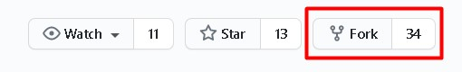
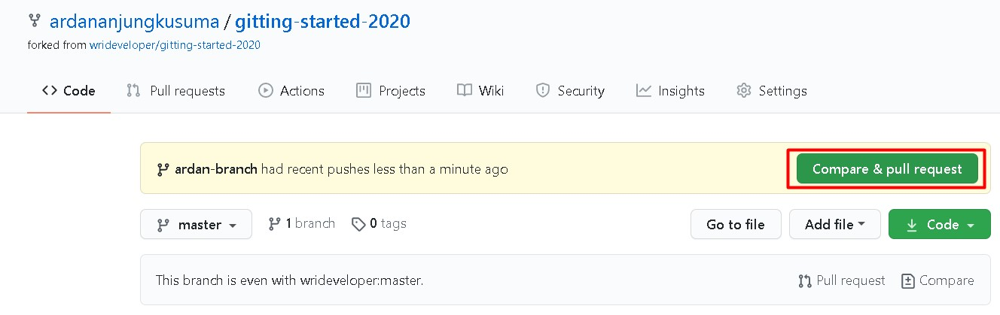
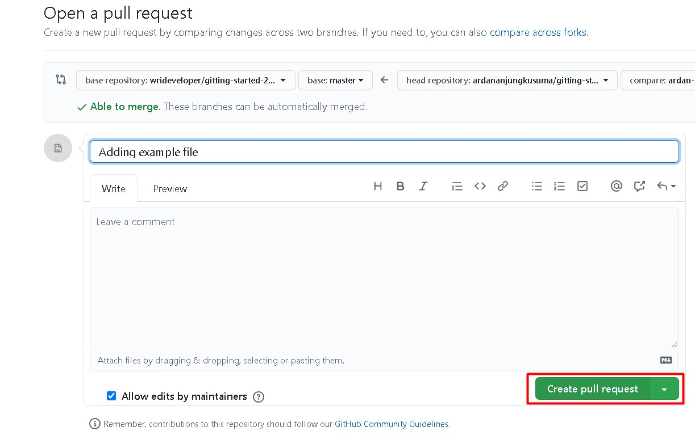
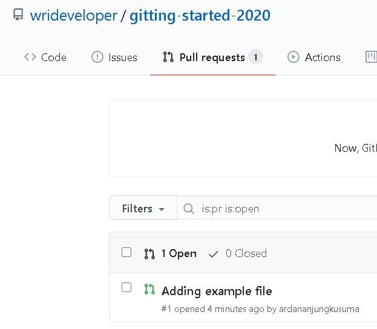

# Gitting Started :milky_way:

Gitting Started adalah Event Hacktoberfest yang diselenggarakan oleh WRI Polinema.

## Cara Kontribusi Pada Repository Ini :inbox_tray:

### 1. Fork Repository

Pada pojok kanan atas terdapat sebuah button untuk fork, silahkan fork repository ini



### 2. Clone Repository di Akunmu

Pergilah ke halaman akun github anda, pilih bagian menu repository lalu pilih repository gitting-started-2020

`git clone https://github.com/usernamekamu/gitting-started-2020.git`

### 3. Buat Branch Baru

Masuk ke folder yang telah anda clone tadi, lalu ketikkan perintah berikut pada git bash

`git checkout -b usernamekamu-branch`

### 4. Buat Folder Baru Didalam Folder `src`

Didalam src buatlah folder sesuai dengan username akun github kamu. Jadi nanti struktur foldernya akan seperti ini.

<!-- AUTO-GENERATED-CONTENT:START (DIRTREE:dir=./&depth=1) -->

```
src/
├── ardan
├── faris
├── ijal
├── usernamekamu
├── john_doe
└── sultan
```

<!-- AUTO-GENERATED-CONTENT:END -->

Jangan sembarangan dalam membuat struktur folder dan file ya, nanti pullreqnya akan kami anggap tidak valid :stuck_out_tongue:

### 5. Tambahkan Script Yang Pernah Anda Buat :smirk_cat:

Setelah itu tambahkan file yang pernah anda buat didalam folder milikmu, contohnya seperti dibawah semisal menambahkan script binarysearch.java maka struktur foldernya akan seperti gambar dibawah.

```
src/
├── ardan
├── faris
├── ijal
├── usernamekamu
    ├── binarysearch.java
├── john_doe
└── sultan
```

### 6. Push Project Anda

Kembalilah ke root folder. Lalu tambahkan folder yang telah anda buat tadi, jika anda sudah membuat folder maka tambahkan file yang anda buat tadi.

`git add .`

Tambahkan pesan commit

`git commit -m "Adding binarysearch.java"`

Push project yang telah anda buat dengan perintah

`git push -u origin usernamekamu-branch`

### 7. Buat Pull Request

Buka kembali browsermu dan pergi ke repository gitting started milikmu. Jika berhasil melakukan perubahan atau penambahan suatu file maka akan muncul tombol berikut untuk membandingkan dan membuat pull request. Klik tombol berikut.



Setelah itu scroll agak kebawah dan klik tombol create pull request



Dan anda telah berhasil membuat pull request.



Jika struktur folder anda sesuai maka pull request akan segera diacc dan dianggap valid. Namun jika tidak sesuai pull request akan diclose.

## Organization


